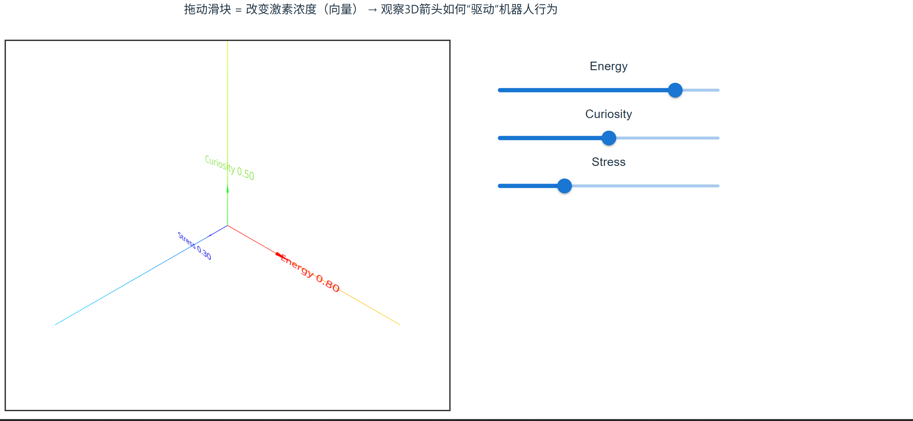

# 第1周笔记 - 线性代数直觉

## 视频总结
- 01集：向量究竟是什么？ → 
- 02集：线性组合、张成的空间与基 → 

## 代码运行截图

## 思考
1. 在人工激素系统中，[energy, curiosity, stress] 为什么是一个向量？
2. 如果我对这个向量施加一个矩阵变换（下周内容），它会如何改变机器人行为？

## 遇到的问题 & 解决
（写在这里，我帮你debug）